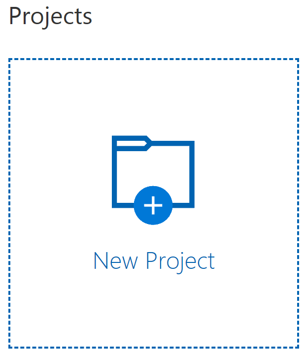

# Creating and configuring the Custom Vision service

This sample uses an online service to analyze and recognize the picture's content. The cognitive service is provided and powered by Azure. For maximum efficiency, the service needs to be trained. This section explains how the service can be created and trained for our purpose. Later we will see how the Xamarin application is configured to use the service.

## Creating the custom vision project

- Open [CustomVision.ai](https://customvision.ai) in your favorite web browser.

- Click on New Project

- In the New project drawer, enter the following information:

    - Name: FruitRecognizer
    - Description: Enter a description for your project
    - Domains: Select the *Food* option
    - Resource Group: You can select *Limited Trial* or link the Custom Vision service to an existing subscription on Azure.

> **NOTE:** In addition to the Limited Trial, you can create a free Azure account to try the services .